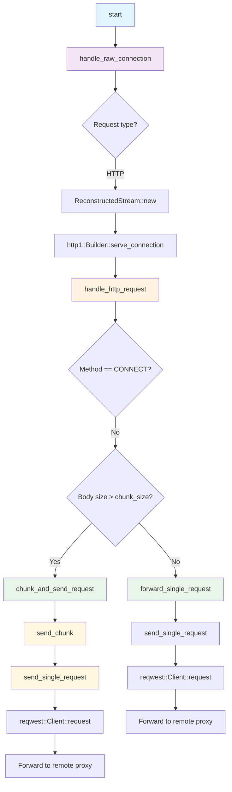
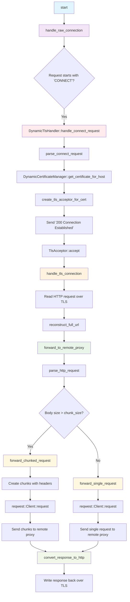

## Normal HTTP Request Flow

```mermaid
graph TD
    A[start] --> B[handle_raw_connection]
    B --> C{Request type?}
    C -->|HTTP| D[ReconstructedStream::new]
    D --> E[http1::Builder::serve_connection]
    E --> F[handle_http_request]
    F --> G{Method == CONNECT?}
    G -->|No| H{Body size > chunk_size?}
    H -->|Yes| I[chunk_and_send_request]
    H -->|No| J[forward_single_request]
    
    I --> K[send_chunk]
    K --> L[send_single_request]
    L --> M[reqwest::Client::request]
    M --> N[Forward to remote proxy]
    
    J --> O[send_single_request]
    O --> P[reqwest::Client::request]
    P --> Q[Forward to remote proxy]
    
    style A fill:#e1f5fe
    style B fill:#f3e5f5
    style F fill:#fff3e0
    style I fill:#e8f5e8
    style J fill:#e8f5e8
    style K fill:#fff8e1
    style L fill:#fff8e1
```

## CONNECT Request Flow (HTTPS Interception)

```mermaid
graph TD
    A[start] --> B[handle_raw_connection]
    B --> C{Request starts with 'CONNECT'?}
    C -->|Yes| D[DynamicTlsHandler::handle_connect_request]
    D --> E[parse_connect_request]
    E --> F[DynamicCertificateManager::get_certificate_for_host]
    F --> G[create_tls_acceptor_for_cert]
    G --> H[Send '200 Connection Established']
    H --> I[TlsAcceptor::accept]
    I --> J[handle_tls_connection]
    J --> K[Read HTTP request over TLS]
    K --> L[reconstruct_full_url]
    L --> M[forward_to_remote_proxy]
    M --> N[parse_http_request]
    N --> O{Body size > chunk_size?}
    O -->|Yes| P[forward_chunked_request]
    O -->|No| Q[forward_single_request]
    
    P --> R[Create chunks with headers]
    R --> S[reqwest::Client::request]
    S --> T[Send chunks to remote proxy]
    
    Q --> U[reqwest::Client::request]
    U --> V[Send single request to remote proxy]
    
    T --> W[convert_response_to_http]
    V --> W
    W --> X[Write response back over TLS]
    
    style A fill:#e1f5fe
    style B fill:#f3e5f5
    style D fill:#ffebee
    style J fill:#fff3e0
    style M fill:#e8f5e8
    style P fill:#fff8e1
    style Q fill:#fff8e1
    style W fill:#f1f8e9
```